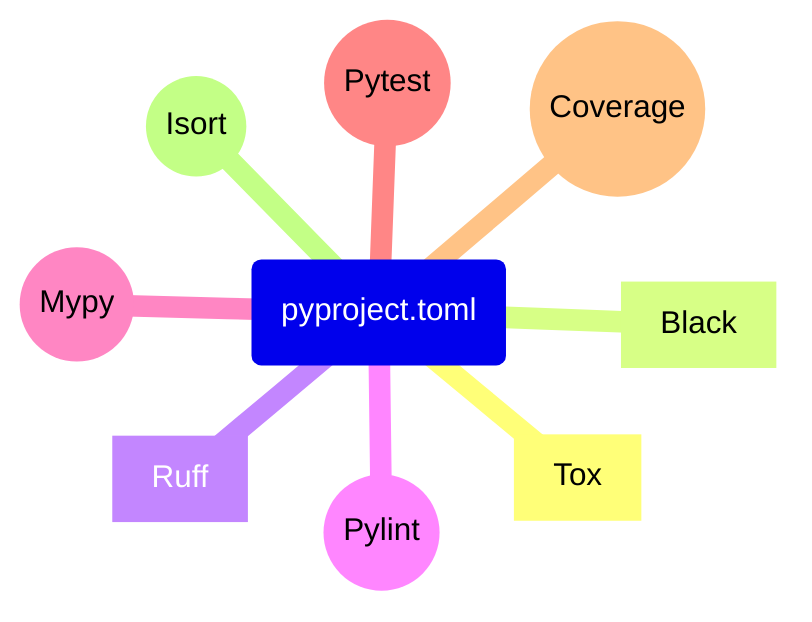

<br/>

## Build Systems, Package Managers, `pyproject.toml`
## and you - how to work with Python in 2023

<br/>

PyCon Israel 2023, Jonathan Daniel


<div class="toml-block" style>

```toml
# talk.toml
[talk]
title = "My talk"
speaker = "Jonathan"

[build-system]
requires = ["slidev"]
```

</div>

<style>
.toml-block {
  text-align: left;
  width: 50%;
  margin: auto;
}
</style>

<!--
Talk a bit about:
1. The topic, why is it worth the time
2. Myself, why I'm speaking to you today
-->

---
transition: fade-out
---

# What is the Talk About?

The latest standards and tools for managing Python projects. <logos-python />

- **Build systems** - transform the source package into a distributable wheel file
- **Package managers** - manage the project dependencies and virtual environments
- **`pyproject.toml`** - project configuration, including the build system and the dependencies


<style>
h1 {
  background-color: #2B90B6;
  background-image: linear-gradient(45deg, #4EC5D4 10%, #146b8c 20%);
  background-size: 100%;
  -webkit-background-clip: text;
  -moz-background-clip: text;
  -webkit-text-fill-color: transparent;
  -moz-text-fill-color: transparent;
}
</style>

---
transition: fade
---

# Development Life Cycle

Typically, when working on a software project we:

1. Think about a solution and implement it.
2. Test it in different environments and collaborate with colleagues.
3. Ship it to users.

---
transition: slide-up
---

# Development Life Cycle in Python <logos-python />

Specifically, in Python, we encounter these tasks regularly:

1. Open a *virtual environment* (venv), add dependencies, write Python code.
2. Change dependencies, run tests, checks and linters on another system.
3. Publish a package to PyPI/internally, or change a Docker image.

<v-click>

Sounds easy, right?

Almost...

1. Virtual environments are clumsy and making them reproducible and **stable** with `pip` and `requirements.txt` is not trivial.
2. Is the same package version installed on my venv and somewhere else? 
3. Do you want to not duplicate the package version in code and in the metadata? Choose one of 7 ways.

</v-click>

---

# Complaints From the Past

Rust Developer complains about the Python packaging system:

<Transform scale=2.5>
<Youtube id="9g8mp8TqAQ0" />
</Transform>

---
transition: slide-up
---

# `pip` + `requirements.txt`

Are they good enough?

<div grid="~ cols-2 gap-2" m="-t-2">

<div>

```sh
$ pip install torch
```

<v-click>

```sh
$ pip install numpy
$ pip install pandas
```

</v-click>

</div>

<div>

```
# requirements.txt

torch >= 1.11.0
```

</div>

</div>

<v-click>

This tandem is high maintenance and error prone, not to mention multiple files.

Is it in the venv?
</v-click>

---
transition: slide-up
---

# Adding a Dependency with a Single Command

Instead of maintaining multiple files and configs, adopt a modern package manager.

Some examples are: `poetry`, `hatch`, `pdm`, all are CLI tools.

Adding a dependency follows an idiomatic form:

```sh
$ poetry add torch
```

<v-click>

Bonus:

If you use PDM or Poetry - you get a lock file:

- `pdm.lock`
- `poetry.lock`

</v-click>

---

# <fxemoji-lock /> Locking Dependencies

Why do you need a `.lock` file?

Reliable and reproducible venvs for applications.

- <octicon-cache-16 class="text-3x1" /> - caching environments
- <jam-shield-half class="text-4x2" /> - improving supply chain security

<!--
Mention the changing world: software, PyPI.
Renovate by Mend, Dependabot by GitHub, Snyk.
-->

---

# On par with Other Langauges

|                  | Language  | Tools              | Manifest file    |
|------------------|-----------|--------------------|------------------|
| <logos-python /> | Python    | hatch, pdm, poetry | `pyproject.toml` |
| <logos-nodejs /> | Node.js * | npm, yarn, pnpm    | `package.json`   |
| <logos-rust />   | Rust      | cargo              | `Cargo.toml`     |


<!--
* Node.js is a runtime for the JavaScript language.

Lock files:
- Python:
  - The rejected [PEP 665](https://peps.python.org/pep-0665/)
  - Poetry (`poetry.lock`): https://python-poetry.org/docs/libraries#lock-file
  - PDM (`pdm.lock`): https://pdm.fming.dev/latest/usage/dependency/#install-the-packages-pinned-in-lock-file
- Node.js (see https://pnpm.io/feature-comparison):
  - npm (`package-lock.json`): https://docs.npmjs.com/cli/v9/configuring-npm/package-lock-json
  - yarn (`yarn.lock`): https://yarnpkg.com/getting-started/qa#should-lockfiles-be-committed-to-the-repository
  - pnpm (`pnpm-lock.yaml`): https://pnpm.io/git#lockfiles
- Rust (`Cargo.lock`): https://doc.rust-lang.org/cargo/guide/cargo-toml-vs-cargo-lock.html
-->

---
layout: cover
background: ./images/ship.jpg
---

# **Building Packages from `pyproject.toml`**

---
transition: fade
---

# Build System and Backend

For example:

```toml
# pyproject.toml

[build-system]
requires = ["hatchling"]
build-backend = "hatchling.build"
```

`requires` is a list of Python packages used to build the project.
Hatchling is a *build backend*.

The following command can build the project:

```sh
$ hatch build
```

Hatch is a *build frontend*.

---
transition: slide-up
---

# Build System and Backend

The project can also be built by `pip` *frontend*:

```sh
$ pip wheel .
```

But NOT:

```sh
$ poetry build
```

As Poetry frontend builds only `poetry-core` projects.

---

# Build Frontends and Backends

Build frontend = the CLI, build backend = the Python package that builds the project.

<div grid="~ cols-2 gap-2" m="-t-2">

<div>

- Pip & setuptools
- Flit & flit_core
- PDM & PDM-Backend
- Hatch & Hatchling

E.g.:

```toml
[build-system]
requires = ["setuptools >= 40.9.0"]
build-backend = "setuptools.build_meta"
```

</div>

<div>

- Poetry & Poetry-core

E.g.:

```toml
[build-system]
requires = [
  "poetry-core >= 1.0.0",
  "poetry-dynamic-versioning >= 0.23.0",
]
build-backend = "poetry_dynamic_versioning.backend"
```

</div>

</div>

<!--
One should not mix between Poetry and the rest.
-->

---
layout: cover
background: ./images/warehouse.jpg
transition: fade
---


# **`pyproject.toml` as Tools Configuration Source**


---
transition: fade
---

# Python Project

<div grid="~ cols-2 gap-2" m="-t-2">

```
.
├── .coveragerc
├── .isort.cfg
├── .mypy.ini
├── .pylintrc
├── .pytest.ini
├── tox.ini
├── requirements.txt
├── dev-requirements.txt
├── MANIFEST.in
├── README.md
├── setup.py
└── <package>/
    ├── __init__.py
    └── <py files>
```

<div v-click class="text-xl p-2">

With all the configurations and the dependencies in `pyproject.toml`:

```
.
├── README.md
├── pyproject.toml
└── <package>/
    ├── __init__.py
    └── <py files>
```

Neat and tidy.

</div>

</div>

<!--
Explain what is TOML - a cousin of JSON and YAML.

The file tree:
https://tree.nathanfriend.io/?s=(%27options!(%27fancy2~fullPath!false~trail7gSlash2~rootDot2)~6(%276%27.coveragerc*.isort.cfg*.mypy34l7trc*4test3tox30dev-0MANIFEST.7*README.md*setup4*%3Cpackage%3E5__7it__45%3Cpy%20files%3E%27)~version!%271%27)*%5Cn0requirements.txt*2!true3.7i*4.py5*%20%206source!7in%017654320*

If the package is typed, expect a single empty `py.typed` file next to the top-level
`__init__.py` file. See PEP 561: https://peps.python.org/pep-0561/
-->

---
transition: fade
---

<div grid="~ cols-2 gap-2" m="-t-2">
<div>


<div v-click="7" style="display: flex; font-size: 60px;">
<div>

</div>
<div style="margin-top: 10px; margin-left: 30px;">
<p>
Pylint
</p>
</div>
</div>


<div v-click="10" style="display: flex; font-size: 55px;">
<div>

</div>
<div style="margin-top: 10px; margin-left: 15px;">
<p>
Coverage.py
</p>
</div>
</div>

</div>

<div>

```toml {1|3-4|6-8|10-12|14-16|18-25|all}
# pyproject.toml

[tool.isort]
profile = "black"

[tool.pylint]
enable = ["I"]
fail-on = ["useless-suppression"]

[tool.mypy]
strict = true
exclude = ["dist/"]

[tool.pytest.ini_options]
filterwarnings = ["error"]
addopts = ["--import-mode=importlib"]

[tool.coverage.run]
branch = true
source = ["<package>"]

[tool.coverage.report]
fail_under = 100
show_missing = true
skip_empty = true
```

</div>
</div>

---
class: text-center
transition: fade
---

# <file-icons-config-python /> Configure Your Tools in `pyproject.toml`



<!--
Mention:
Black, Tox, and Ruff.

If you build a new tool - support configuring it from `pyproject.toml`.
In Python 3.11+ - use the builtin `tomllib` for reading it.
-->

---

# `tomllib` - New in Python 3.11

New standard library module `tomllib` - support for parsing TOML.

```py
>>> import tomllib
>>> with open("pyproject.toml", "rb") as f:
>>>     config = tomllib.load(f)
>>> config["tool"]["mypy"]
{'strict': True, 'exclude': ['dist/']}
```

If you write a new tool for Python - support `pyproject.toml` configuration.

<div style="
  position: absolute;
  top: 63%;
  left: 50%;
  transform: translate(-50%, -50%);
  font-size: 65px;
">

<logos-python /> 🤝 <logos-toml />

</div>

<!--
https://docs.python.org/3/whatsnew/3.11.html#summary-release-highlights
-->

---

# Why Bother About One Config File?

<div grid="~ cols-2 gap-2" m="-t-2">

<div>
Avoid a clutter of tens of files for all the tools, and configure them all in
<code>pyproject.toml</code>.

See the situation for TypeScript <logos-typescript-icon /> projects:
<br/>
<br/>

<v-click>

Well done Python <logos-python />!

</v-click>

</div>

<div>
<Tweet id="1672839156647575552" scale=0.65 />
</div>

</div>

---

# Is Poetry the Perfect Solution?

Not yet. Some drawbacks of Poetry:

- Not
  [PEP 621](https://packaging.python.org/en/latest/specifications/declaring-project-metadata/)
  compliant - registers its metadata under `[tool.poetry]` instead of `[project]`
  in `pyproject.toml`
- Missing dynamic version - need to declare the version both in the code:
  ```py
  # __init__.py
  __version__ = "..."
  ```
  and the manifest:
  ```toml
  # pyproject.toml
  [tool.poetry]
  version = "..."
  ```
  (although some 
  [plugins](https://github.com/mtkennerly/poetry-dynamic-versioning) 
  are available)
- The default dependency specification is nonconventional - 
  [caret (`^`) specification](https://python-poetry.org/docs/dependency-specification/#caret-requirements)

<!--
Some more criticism of Poetry is available here, by [Henry Schreiner](https://iscinumpy.dev/):
- https://iscinumpy.dev/post/bound-version-constraints/
- https://iscinumpy.dev/post/poetry-versions/
-->

---

# Rye - the Newest Tool in Town

(Roughly) Rye = Pyenv + PDM/Poetry.

<p align="center">
  <a href="https://rye-up.com/">
  
  </a>
</p>

- Rye manages also the Python installation, as Pyenv does,  
  in addition to package and dependency management.
- Its development has begun this year by [Flask's author](https://lucumr.pocoo.org/).
- Cross platform, built in Rust (<logos-rust /> for <logos-python />).

<style>
.slidev-layout {
  background-image: url("https://raw.githubusercontent.com/mitsuhiko/rye/main/docs/static/banner.png");
  background-repeat: repeat-y;
  color: black;
  
  h1 {
    color: white;
  }
  
  p {
    color: #fec742;
    opacity: 1;
  }
}
</style>

---

# Take Aways from the Talk

- `pyproject.toml` is here to stay
- The modern build frontends provide much more than a package -> `.whl` solution - they let you also manage dependencies
- Best to choose the proper tool for you and stick with it

---
layout: center
---

# Thank You

The slides:
<div style="font-family: var(--slidev-code-font-family);">

[jond01.github.io/blog/pycon-il-23](https://jond01.github.io/blog/pycon-il-23/)


<carbon-logo-github /> [jond01](https://github.com/jond01)<br/>
<carbon-logo-linkedin /> [jonathan&ndash;&ndash;daniel](https://www.linkedin.com/in/jonathan--daniel/)
</div>
