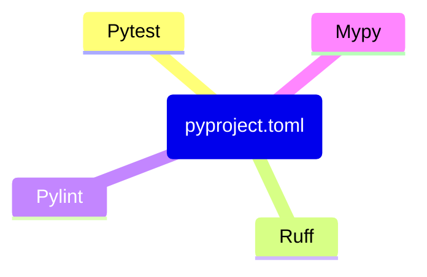

<br/>

## Build Systems, Package Managers, `pyproject.toml`
## and you - how to work with Python in 2023

<br/>

PyCon Israel 2023, Jonathan Daniel


<div class="toml-block" style>

```toml
# talk.toml
[talk]
title = "My talk"
speaker = "Jonathan"

[build-system]
requires = ["slidev"]
```

</div>

<div class="pt-12">
  <span @click="$slidev.nav.next" class="px-2 py-1 rounded cursor-pointer" hover="bg-white bg-opacity-10">
    Press Space for next page <carbon:arrow-right class="inline"/>
  </span>
</div>

<div class="abs-br m-6 flex gap-2">
  <button @click="$slidev.nav.openInEditor()" title="Open in Editor" class="text-xl slidev-icon-btn opacity-50 !border-none !hover:text-white">
    <carbon:edit />
  </button>
  <a href="https://github.com/slidevjs/slidev" target="_blank" alt="GitHub"
    class="text-xl slidev-icon-btn opacity-50 !border-none !hover:text-white">
    <carbon-logo-github />
  </a>
</div>

<style>
.toml-block {
  text-align: left;
  width: 50%;
  margin: auto;
}
code {
  background-color: rgba(0, 0, 0, 0);
}
</style>

<!--
The last comment block of each slide will be treated as slide notes. It will be visible and editable in Presenter Mode along with the slide. [Read more in the docs](https://sli.dev/guide/syntax.html#notes)
-->

---
transition: fade-out
---

# What is Slidev?

Slidev is a slides maker and presenter designed for developers, consist of the following features

- 📝 **Text-based** - focus on the content with Markdown, and then style them later
- 🎨 **Themable** - theme can be shared and used with npm packages
- 🧑‍💻 **Developer Friendly** - code highlighting, live coding with autocompletion
- 🤹 **Interactive** - embedding Vue components to enhance your expressions
- 🎥 **Recording** - built-in recording and camera view
- 📤 **Portable** - export into PDF, PNGs, or even a hostable SPA
- 🛠 **Hackable** - anything possible on a webpage

<br>
<br>

Read more about [Why Slidev?](https://sli.dev/guide/why)

<!--
You can have `style` tag in markdown to override the style for the current page.
Learn more: https://sli.dev/guide/syntax#embedded-styles
-->

<style>
h1 {
  background-color: #2B90B6;
  background-image: linear-gradient(45deg, #4EC5D4 10%, #146b8c 20%);
  background-size: 100%;
  -webkit-background-clip: text;
  -moz-background-clip: text;
  -webkit-text-fill-color: transparent;
  -moz-text-fill-color: transparent;
}
</style>

<!--
Here is another comment.
-->

---
layout: default
---

# Table of contents

```
<Toc minDepth="1" maxDepth="5"></Toc>
```

<Toc></Toc>

---
layout: image-right
image: https://source.unsplash.com/collection/94734566/1920x1080
---

# Code

Use code snippets and get the highlighting directly![^1]

```ts {all|2|1-6|9|all}
interface User {
  id: number
  firstName: string
  lastName: string
  role: string
}

function updateUser(id: number, update: User) {
  const user = getUser(id)
  const newUser = { ...user, ...update }
  saveUser(id, newUser)
}
```

<arrow v-click="3" x1="400" y1="420" x2="230" y2="330" color="#564" width="3" arrowSize="1" />

[^1]: [Learn More](https://sli.dev/guide/syntax.html#line-highlighting)

<style>
.footnotes-sep {
  @apply mt-20 opacity-10;
}
.footnotes {
  @apply text-sm opacity-75;
}
.footnote-backref {
  display: none;
}
</style>

---

# Components

<div grid="~ cols-2 gap-4">
<div>

You can use Vue components directly inside your slides.

We have provided a few built-in components like `<Tweet/>` and `<Youtube/>` that you can use directly. And adding your custom components is also super easy.

```html
<Counter :count="10" />
```

<!-- ./components/Counter.vue -->
<Counter :count="10" m="t-4" />

Check out [the guides](https://sli.dev/builtin/components.html) for more.

</div>
<div>

```html
<Tweet id="1390115482657726468" />
```

<Tweet id="1390115482657726468" scale="0.65" />

</div>
</div>

<!--
Presenter note with **bold**, *italic*, and ~~striked~~ text.

Also, HTML elements are valid:
<div class="flex w-full">
  <span style="flex-grow: 1;">Left content</span>
  <span>Right content</span>
</div>
-->


---
class: px-20
---

# Python Project

<div grid="~ cols-2 gap-2" m="-t-2">

```
.
├── .coveragerc
├── .isort.cfg
├── .mypy.ini
├── .pylintrc
├── .pytest.ini
├── tox.ini
├── requirements.txt
├── dev-requirements.txt
├── MANIFEST.in
├── README.md
├── setup.py
└── <package>/
    ├── __init__.py
    └── <py files>
```

<div v-click class="text-xl p-2">

With all the configurations and the dependencies in `pyproject.toml`:

```
.
├── README.md
├── pyproject.toml
└── <package>/
    ├── __init__.py
    └── <py files>
```

Much more tidy.

</div>

</div>

<!--

The file tree:
https://tree.nathanfriend.io/?s=(%27options!(%27fancy2~fullPath!false~trail7gSlash2~rootDot2)~6(%276%27.coveragerc*.isort.cfg*.mypy34l7trc*4test3tox30dev-0MANIFEST.7*README.md*setup4*%3Cpackage%3E5__7it__45%3Cpy%20files%3E%27)~version!%271%27)*%5Cn0requirements.txt*2!true3.7i*4.py5*%20%206source!7in%017654320*

If the package is typed, expect a single empty `py.typed` file next to the top-level
`__init__.py` file. See PEP 561: https://peps.python.org/pep-0561/
-->

---

# Build Backend

<SlideCurrentNo />

---

# <fxemoji-lock /> Locking Dependencies

- <octicon-cache-16 class="text-3x1" /> - caching environments
- <jam-shield-half class="text-4x2" /> - improving supply chain security

---

# List of Tools

* Hatch & Hatchling
* Poetry & Poetry-core
* PDM & PDM-Backend

---

# <mdi-cog /> Configure Your Tools in `pyproject.toml`

You can create diagrams / graphs from textual descriptions, directly in your Markdown.

<div class="gap-10 pt-4 -mb-6">



</div>

---
src: ./pages/multiple-entries.md
hide: false
---

---

# On par with Other Langauges

|                  | Language  | Tools              | Manifest file    |
|------------------|-----------|--------------------|------------------|
| <logos-python /> | Python    | hatch, pdm, poetry | `pyproject.toml` |
| <logos-nodejs /> | Node.js * | npm, yarn, pnpm    | `package.json`   |
| <logos-rust />   | Rust      | cargo              | `Cargo.toml`     |


<!--
* Node.js is a runtime for the JavaScript language.

Lock files:
- Python:
  - The rejected [PEP 665](https://peps.python.org/pep-0665/)
  - Poetry (`poetry.lock`): https://python-poetry.org/docs/libraries#lock-file
  - PDM (`pdm.lock`): https://pdm.fming.dev/latest/usage/dependency/#install-the-packages-pinned-in-lock-file
- Node.js (see https://pnpm.io/feature-comparison):
  - npm (`package-lock.json`): https://docs.npmjs.com/cli/v9/configuring-npm/package-lock-json
  - yarn (`yarn.lock`): https://yarnpkg.com/getting-started/qa#should-lockfiles-be-committed-to-the-repository
  - pnpm (`pnpm-lock.yaml`): https://pnpm.io/git#lockfiles
- Rust (`Cargo.lock`): https://doc.rust-lang.org/cargo/guide/cargo-toml-vs-cargo-lock.html
-->

---
layout: center
---

# Thank You

The slides:<br/>
[`jond01.github.io/blog/pycon-il-23`](https://jond01.github.io/blog/pycon-il-23/)


<carbon-logo-github /> [`jond01`](https://github.com/jond01)<br/>
<carbon-logo-linkedin /> [`jonathan--daniel`](https://www.linkedin.com/in/jonathan--daniel/)


---
hideInToc: true
---

# Is Poetry the Perfect Solution?

Not yet. Some drawbacks of Poetry:

- Not
  [PEP 621](https://packaging.python.org/en/latest/specifications/declaring-project-metadata/)
  compliant - registers its metadata under `[tool.poetry]` instead of `[project]`
  in `pyproject.toml`
- Missing dynamic version - need to declare the version both in the code:
  ```py
  # __init__.py
  __version__ = "..."
  ```
  and the manifest:
  ```toml
  # pyproject.toml
  [tool.poetry]
  version = "..."
  ```
  (although some 
  [plugins](https://github.com/mtkennerly/poetry-dynamic-versioning) 
  are available)
- The default dependency specification is nonconventional - 
  [caret (`^`) specification](https://python-poetry.org/docs/dependency-specification/#caret-requirements)

<!--
Some more criticism of Poetry is available here, by [Henry Schreiner](https://iscinumpy.dev/):
- https://iscinumpy.dev/post/bound-version-constraints/
- https://iscinumpy.dev/post/poetry-versions/
-->

---
hideInToc: true
---

# Why Bother About One Config File?

<div grid="~ cols-2 gap-2" m="-t-2">

<div>
Avoid a clutter of tens of files for each tool, and configure them all in
<code>pyproject.toml</code>.

See the situation for TypeScript projects:
</div>

<div>
<Tweet id="1672839156647575552" scale=0.65 />
</div>

</div>

---
hideInToc: true
---

# Rye - the Newest Tool in Town

(Roughly) Rye = Pyenv + PDM/Poetry.

<p align="center">
  <a href="https://rye-up.com/">
  
  </a>
</p>

- Rye manages also the Python installation, as Pyenv does,  
  in addition to package and dependency management.
- Its development has begun this year by [Flask's author](https://lucumr.pocoo.org/).
- Cross platform, built in Rust (<logos-rust /> for <logos-python />).
