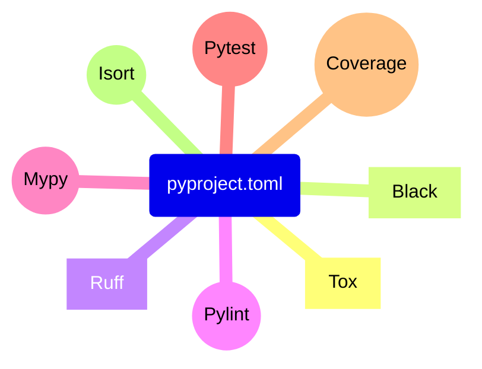
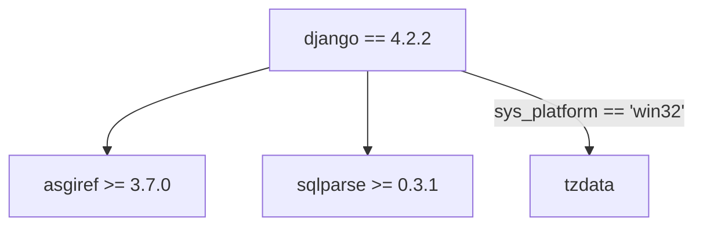

<br/>

## Build Systems, Package Managers, `pyproject.toml`
## and you - how to work with Python in 2023

<br/>

PyCon Israel 2023, Jonathan Daniel


<div class="toml-block" style>

```toml
# talk.toml
[talk]
title = "My talk"
speaker = "Jonathan"

[build-system]
requires = ["slidev"]
```

</div>

<style>
.toml-block {
  text-align: left;
  width: 50%;
  margin: auto;
}
</style>


---
transition: fade
---

# Who am I?

- Software and Algorithm Engineer
- Python is my main language in the past 6+ years, across multiple domains
- Released a few packages to PyPI
- (A bit) Obsessed with order and organization

<!--
Talk a bit about myself, why I'm speaking to you today.
-->

---
transition: fade
---

# What is the Talk About?

The latest standards and tools for managing Python projects. <logos-python />

<div grid="~ cols-2 gap-2" m="-t-2">

<div>

1. **`pyproject.toml`** - project configuration source
2. **Package managers** - manage the dependencies and virtual environments
3. **Build systems** - source code → distributable wheel

</div>

<div>

</div>

</div>


<style>
h1 {
  background-color: #2B90B6;
  background-image: linear-gradient(45deg, #4EC5D4 10%, #146b8c 20%);
  background-size: 100%;
  -webkit-background-clip: text;
  -moz-background-clip: text;
  -webkit-text-fill-color: transparent;
  -moz-text-fill-color: transparent;
}
</style>

<!--
Why is the topic worth your time?

Excalidraw link:
https://excalidraw.com/#json=ezZzlh7lPrhMScvhX5CGh,ZstIkLIUOb2jIVcTbgniUw
-->

---
transition: fade
---

# Development Life Cycle

When working on a software project we:

<div grid="~ cols-2 gap-2" m="-t-2">

<div>

1. Think about a solution and implement it
2. Test in different environments and pass checks
3. Ship to users

</div>

<div>

</div>
</div>

<!--
https://excalidraw.com/#json=CJdJGbUGhuhObHECY9x9d,BhNmthqf7VSQFyPmHn8kew
-->

---
transition: slide-up
---

# Development Life Cycle in Python <logos-python />

Specifically, in Python, we encounter these tasks regularly:

1. Open a *virtual environment* (venv), add dependencies, write Python code
2. Run tests, checks and linters
3. Publish a package to PyPI/internally, or change a Docker image

<v-click>

Sounds easy, right?

Almost...

- What are all the tools used?
- Venvs are not trivial to precisely reproduce with `pip`
- Missing `.whl` for your platform - manually compile from source

</v-click>

---
layout: cover
background: ./images/warehouse.jpg
transition: fade
---


# **`pyproject.toml` as Tools Configuration Source**


---
transition: fade
---

# Python Project

<div grid="~ cols-2 gap-2" m="-t-2">

```
.
├── .coveragerc
├── .isort.cfg
├── .mypy.ini
├── .pylintrc
├── .pytest.ini
├── tox.ini
├── requirements.txt
├── dev-requirements.txt
├── MANIFEST.in
├── README.md
├── setup.py
└── <package>/
    ├── __init__.py
    └── <py files>
```

<div v-click class="text-xl p-2">

With all the configurations and the dependencies in `pyproject.toml`:

```
.
├── README.md
├── pyproject.toml
├── poetry.lock
└── <package>/
    ├── __init__.py
    └── <py files>
```

Neat and tidy.


<div style="
  position: absolute;
  top: 82%;
  left: 50%;
  transform: translate(-50%, -50%);
  font-size: 65px;
">

<logos-python /> 🤝 <logos-toml />

</div>

</div>

</div>

<!--
Explain what is TOML - a cousin of JSON and YAML.

The file tree:
https://tree.nathanfriend.io/?s=(%27options!(%27fancy2~fullPath!false~trail7gSlash2~rootDot2)~6(%276%27.coveragerc*.isort.cfg*.mypy34l7trc*4test3tox30dev-0MANIFEST.7*README.md*setup4*%3Cpackage%3E5__7it__45%3Cpy%20files%3E%27)~version!%271%27)*%5Cn0requirements.txt*2!true3.7i*4.py5*%20%206source!7in%017654320*

If the package is typed, expect a single empty `py.typed` file next to the top-level
`__init__.py` file. See PEP 561: https://peps.python.org/pep-0561/
-->

---
transition: fade
---

<div grid="~ cols-2 gap-2" m="-t-2">
<div>


<div v-click="7" style="display: flex; font-size: 60px;">
<div>

</div>
<div style="margin-top: 10px; margin-left: 30px;">
<p>
Pylint
</p>
</div>
</div>


<div v-click="10" style="display: flex; font-size: 55px;">
<div>

</div>
<div style="margin-top: 10px; margin-left: 15px;">
<p>
Coverage.py
</p>
</div>
</div>

</div>

<div>

```toml {1|3-4|6-8|10-12|14-16|18-25|all}
# pyproject.toml

[tool.isort]
profile = "black"

[tool.pylint]
enable = ["I"]
fail-on = ["useless-suppression"]

[tool.mypy]
strict = true
exclude = ["dist/"]

[tool.pytest.ini_options]
filterwarnings = ["error"]
addopts = ["--import-mode=importlib"]

[tool.coverage.run]
branch = true
source = ["<package>"]

[tool.coverage.report]
fail_under = 100
show_missing = true
skip_empty = true
```

</div>
</div>

---
transition: slide-up
---

# <file-icons-config-python /> Configure Your Tools in `pyproject.toml`


<div style="
  margin: auto;
  width: 50%;
">



</div>

### New in Python 3.11: `tomllib` - standard library module for parsing TOML

<!--
Mention:
Black, Tox, and Ruff.

If you build a new tool - support configuring it from `pyproject.toml`.
In Python 3.11+ - use the builtin `tomllib` for reading it.

https://docs.python.org/3/whatsnew/3.11.html#summary-release-highlights
-->

---
transition: fade
layout: cover
# TODO: find a better bg
background: https://images.unsplash.com/photo-1530819568329-97653eafbbfa?ixid=MnwxMjA3fDB8MHxwaG90by1wYWdlfHx8fGVufDB8fHx8&ixlib=rb-1.2.1&auto=format&fit=crop&w=2092&q=80
---

# **Package Managers**

---
transition: fade
---

# `pip` + `requirements.txt`

Are they good enough?

<div grid="~ cols-2 gap-2" m="-t-2">

<div>

```sh
$ pip install torch
```

<v-click>

```sh
$ pip install numpy
$ pip install pandas
```

</v-click>

</div>

<div>

```
# requirements.txt

torch >= 1.11.0
```

</div>

</div>

<v-click>

This tandem is high maintenance and error prone, not to mention multiple files.

Is it in the venv?
</v-click>

---
transition: fade
---

# Modern Package Managers

There are 3 major CLI tools:

<div grid="~ cols-2 gap-2" m="-t-2">

<div style="margin-left: 80px;">

<div style="display: flex; font-size: 55px; margin-left: -7px;">
<div>

</div>
<div style="margin-top: 10px; margin-left: 15px;">
<p>
Hatch
</p>
</div>
</div>

<div style="display: flex; font-size: 55px; margin-top: 10px;">
<div>

</div>
<div style="margin-top: 10px; margin-left: 15px;">
<p>
&nbsp;PDM
</p>
</div>
</div>

<div style="display: flex; font-size: 55px; margin-top: 10px; margin-left: 5px;">
<div>

</div>
<div style="margin-top: 10px; margin-left: 15px;">
<p>
&nbsp;Poetry
</p>
</div>
</div>

</div>

<div v-click style="font-size: 25px; margin-top: 50px;">

✅ Install packages

✅ Manage virtual environments

✅ Work with `pyproject.toml`

✅ Build and publish packages

</div>

</div>


---
transition: fade
---

# Add a Dependency with a Single Command

Instead of maintaining multiple files and configs, adopt a modern package manager.

Adding a dependency follows an idiomatic form:

<div grid="~ rows-3 cols-2 gap-2" m="-t-2" style="grid-template-rows: auto 1fr;">

<div>
Terminal
</div>

<div>
<code>pyproject.toml</code>
</div>

<div>
<code>poetry</code>:
```sh
$ poetry add torch
```
</div>

<div>

```toml
[tool.poetry.dependencies]
python = ">=3.8"
torch = "^2.0.1"
```

</div>

<div>
<code>pdm</code> / <code>hatch</code>:
```sh
$ pdm add torch
```

</div>

<div>

```toml
[project]
requires-python = ">=3.8"
dependencies = [
  "torch>=2.0.1",
]
```

</div>

</div>

---
transition: fade
---

# <fxemoji-lock /> Locking Dependencies

Why do you need a `.lock` file?

<div grid="~ cols-2 gap-2" m="-t-2">

<div>

If you use PDM or Poetry - you get a lock file:

- `pdm.lock`
- `poetry.lock`

<v-click>

Reliable and reproducible venvs for applications.

- <octicon-cache-16 class="text-3x1" /> - caching environments
- <jam-shield-half class="text-4x2" /> - improving supply chain security

</v-click>

</div>


<div>



</div>

</div>

<!--
Mention the changing world: software, PyPI.
Renovate by Mend, Dependabot by GitHub, Snyk.

Provide an example:
https://github.com/django/django/tree/4.2.2
Even:
django == 4.2.2

Still leaves a room for unmonitored changes - the indirect deps:
asgiref >= 3.7.0
sqlparse >= 0.3.1
tzdata; sys_platform == 'win32'
-->

---
transition: slide-up
---

# On par with Other Langauges

|                  | Language  | Tools              | Manifest file    |
|------------------|-----------|--------------------|------------------|
| <logos-python /> | Python    | hatch, pdm, poetry | `pyproject.toml` |
| <logos-nodejs /> | Node.js * | npm, yarn, pnpm    | `package.json`   |
| <logos-rust />   | Rust      | cargo              | `Cargo.toml`     |


<!--
* Node.js is a runtime for the JavaScript language.

Lock files:
- Python:
  - The rejected [PEP 665](https://peps.python.org/pep-0665/)
  - Poetry (`poetry.lock`): https://python-poetry.org/docs/libraries#lock-file
  - PDM (`pdm.lock`): https://pdm.fming.dev/latest/usage/dependency/#install-the-packages-pinned-in-lock-file
- Node.js (see https://pnpm.io/feature-comparison):
  - npm (`package-lock.json`): https://docs.npmjs.com/cli/v9/configuring-npm/package-lock-json
  - yarn (`yarn.lock`): https://yarnpkg.com/getting-started/qa#should-lockfiles-be-committed-to-the-repository
  - pnpm (`pnpm-lock.yaml`): https://pnpm.io/git#lockfiles
- Rust (`Cargo.lock`): https://doc.rust-lang.org/cargo/guide/cargo-toml-vs-cargo-lock.html
-->

---
layout: cover
background: ./images/ship.jpg
transition: fade
---

# **Building Packages from `pyproject.toml`**

---
transition: fade
---

# Build System and Backend

For example:

```toml
# pyproject.toml

[build-system]
requires = ["hatchling"]
build-backend = "hatchling.build"
```

`requires` is a list of Python packages used to build the project.
Hatchling is a *build backend*.

The following command can build the project:

```sh
$ hatch build
```

Hatch is a *build frontend*.

---
transition: fade
---

# Build System and Backend

The project can also be built by `pip` *frontend*:

```sh
$ pip wheel .
```

But NOT:

```sh
$ poetry build
```

As Poetry frontend builds only `poetry-core` projects.

---
transition: slide-up
---

# Build Frontends and Backends

Build frontend = the CLI, build backend = the Python package that builds the project.

<div grid="~ cols-2 gap-2" m="-t-2">

<div>

- Pip & setuptools
- Flit & flit_core
- PDM & PDM-Backend
- Hatch & Hatchling

E.g.:

```toml
[build-system]
requires = ["setuptools >= 40.9.0"]
build-backend = "setuptools.build_meta"
```

</div>

<div>

- Poetry & Poetry-core

E.g.:

```toml
[build-system]
requires = [
  "poetry-core >= 1.0.0",
  "poetry-dynamic-versioning >= 0.23.0",
]
build-backend = "poetry_dynamic_versioning.backend"
```

</div>

</div>

<!--
One should not mix between Poetry and the rest.
-->

---

# Is Poetry the Perfect Solution?

Not yet. Some drawbacks of Poetry:

- Not
  [PEP 621](https://packaging.python.org/en/latest/specifications/declaring-project-metadata/)
  compliant - registers its metadata under `[tool.poetry]` instead of `[project]`
  in `pyproject.toml`
- Missing dynamic version - need to declare the version both in the code:
  ```py
  # __init__.py
  __version__ = "..."
  ```
  and the manifest:
  ```toml
  # pyproject.toml
  [tool.poetry]
  version = "..."
  ```
  (although some 
  [plugins](https://github.com/mtkennerly/poetry-dynamic-versioning) 
  are available)
- The default dependency specification is nonconventional - 
  [caret (`^`) specification](https://python-poetry.org/docs/dependency-specification/#caret-requirements)

<!--
Some more criticism of Poetry is available here, by [Henry Schreiner](https://iscinumpy.dev/):
- https://iscinumpy.dev/post/bound-version-constraints/
- https://iscinumpy.dev/post/poetry-versions/
-->

---

# Rye - the Newest Tool in Town

(Roughly) Rye = Pyenv + PDM/Poetry.

<p align="center">
  <a href="https://rye-up.com/">
  
  </a>
</p>

- Rye manages also the Python installation, as Pyenv does,  
  in addition to package and dependency management.
- Its development has begun this year by [Flask's author](https://lucumr.pocoo.org/).
- Cross platform, built in Rust (<logos-rust /> for <logos-python />).

<style>
.slidev-layout {
  background-image: url("/images/rye-banner-bg.png");
  background-repeat: repeat-y;
  color: black;
  
  h1 {
    color: white;
  }
  
  p {
    color: #fec742;
    opacity: 1;
  }
}
</style>

---

# Takeaways

- `pyproject.toml` is here to stay
- PDM, Poetry and Hatch offer a holistic approach to working with Python
- Best to choose the proper tool for you and stick with it

---
layout: center
transition: slide-up
---

# Thank You

The slides:
<div style="font-family: var(--slidev-code-font-family);">

[jond01.github.io/blog/pycon-il-23](https://jond01.github.io/blog/pycon-il-23/)


<carbon-logo-github /> [jond01](https://github.com/jond01)<br/>
<carbon-logo-linkedin /> [jonathan&ndash;&ndash;daniel](https://www.linkedin.com/in/jonathan--daniel/)
</div>

<style>
h1 {
  text-align: center;
}
</style>

---
hideInToc: true
transition: slide-up
---

# Why Bother About One Config File?

<div grid="~ cols-2 gap-2" m="-t-2">

<div>
Avoid a clutter of tens of files for all the tools, and configure them all in
<code>pyproject.toml</code>.

See the situation for TypeScript <logos-typescript-icon /> projects:
<br/>
<br/>

<v-click>

Well done Python <logos-python />!

</v-click>

</div>

<div>
<Tweet id="1672839156647575552" scale=0.65 />
</div>

</div>

---
hideInToc: true
transition: slide-up
---

# Complaints From the Past

Rust Developer complains about the Python packaging system:

<Transform scale=2.5>
<Youtube id="9g8mp8TqAQ0" />
</Transform>

